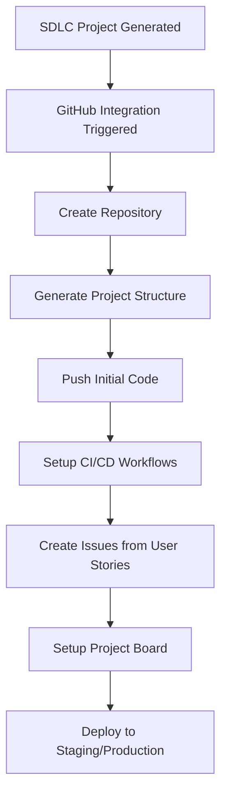

# 🚀 GitHub Integration Prerequisites & Implementation Guide

## 📋 **Prerequisites Checklist**

### **1. GitHub Account Setup**
- [ ] **GitHub Account**: Active GitHub account (free or paid)
- [ ] **Personal Access Token (PAT)**: Fine-grained or classic token
- [ ] **Repository Permissions**: Create repositories, push code, manage issues
- [ ] **Organization Access** (if applicable): Admin rights for organization repos

### **2. GitHub Personal Access Token (CRITICAL)**

#### **🔐 Creating a Personal Access Token:**
1. Go to **GitHub Settings** → **Developer settings** → **Personal access tokens**
2. Click **"Generate new token"** → **"Fine-grained tokens"** (recommended)
3. **Required Scopes:**
   ```
   ✅ Repository permissions:
   - Contents: Read and write
   - Issues: Read and write  
   - Metadata: Read
   - Pull requests: Read and write
   - Actions: Write (for CI/CD)
   - Pages: Write (for documentation)
   - Environments: Write (for deployments)
   
   ✅ Account permissions:
   - Git SSH keys: Write
   - Personal user data: Read
   ```

4. **Save the token securely** - you won't see it again!

### **3. Environment Configuration**

#### **🔧 Required Environment Variables:**
```bash
# Add to your .env file
GITHUB_ACCESS_TOKEN=ghp_your_token_here
GITHUB_USERNAME=your_github_username
GITHUB_DEFAULT_ORG=your_organization_name  # Optional
GITHUB_API_BASE_URL=https://api.github.com  # Default
```

### **4. Python Dependencies**

#### **📦 Required Libraries (Add to requirements.txt):**
```python
# GitHub Integration
PyGithub>=1.59.0          # Official GitHub API client
gitpython>=3.1.40         # Git operations
requests>=2.31.0          # HTTP requests

# Code Generation & Templates  
jinja2>=3.1.0            # Template engine for code/config files
pyyaml>=6.0              # YAML parsing for CI/CD configs
toml>=0.10.2             # TOML parsing for config files

# File Operations
pathlib>=1.0.1           # Path operations
shutil                   # File operations (built-in)
```

### **5. System Requirements**

#### **💻 Local Development:**
- [ ] **Git installed** and configured
- [ ] **SSH keys** configured for GitHub (optional but recommended)
- [ ] **Python 3.8+** with virtual environment
- [ ] **Network access** to GitHub API

#### **🔍 Verify Git Installation:**
```bash
git --version
git config --global user.name "Your Name"
git config --global user.email "your-email@github.com"
```

---

## 🏗️ **Implementation Architecture**

### **GitHub Integration Components:**

```python
# Core GitHub Integration Structure
src/
├── sdlc/
│   ├── integrations/
│   │   ├── __init__.py
│   │   ├── github/
│   │   │   ├── __init__.py
│   │   │   ├── client.py              # GitHub API client
│   │   │   ├── repository_manager.py  # Repo operations
│   │   │   ├── issue_manager.py       # Issues & projects
│   │   │   ├── cicd_generator.py      # CI/CD workflows
│   │   │   └── deployment_manager.py  # Deployment automation
│   │   └── templates/
│   │       ├── github_workflows/      # GitHub Actions templates
│   │       ├── project_configs/       # Config file templates
│   │       └── documentation/         # README/docs templates
```

### **🔄 Integration Workflow:**



---

## 🚀 **Implementation Phases**

### **Phase 1: Core GitHub Client (Week 1)**

#### **🔧 GitHub API Client:**
```python
class GitHubClient:
    def __init__(self, token: str):
        self.github = Github(token)
        self.user = self.github.get_user()
    
    def create_repository(self, name: str, description: str, private: bool = False):
        """Create new GitHub repository"""
        
    def push_files(self, repo, files: Dict[str, str], commit_message: str):
        """Push multiple files to repository"""
        
    def create_branch(self, repo, branch_name: str):
        """Create new branch"""
        
    def create_pull_request(self, repo, title: str, body: str, head: str, base: str):
        """Create pull request"""
```

#### **📁 Repository Manager:**
```python
class RepositoryManager:
    def initialize_project_structure(self, repo, project_type: str):
        """Create complete project structure based on tech stack"""
        
    def generate_readme(self, project_specs: dict) -> str:
        """Generate comprehensive README.md"""
        
    def create_gitignore(self, tech_stack: List[str]) -> str:
        """Generate appropriate .gitignore"""
        
    def setup_branch_protection(self, repo):
        """Configure branch protection rules"""
```

### **Phase 2: CI/CD & Deployment (Week 2)**

#### **⚙️ CI/CD Generator:**
```python
class CICDGenerator:
    def generate_github_actions(self, tech_stack: dict, deployment_target: str):
        """Generate GitHub Actions workflows"""
        
    def create_build_workflow(self, project_specs: dict):
        """Create build and test workflow"""
        
    def create_deployment_workflow(self, deployment_config: dict):
        """Create deployment workflow"""
        
    def setup_environment_secrets(self, repo, secrets: dict):
        """Configure repository secrets for deployment"""
```

#### **🚀 Supported Deployment Targets:**
- **Vercel** (Frontend/Full-stack)
- **Heroku** (Backend/Full-stack)
- **AWS** (EC2, Lambda, ECS)
- **Azure** (App Service, Functions)
- **Google Cloud** (App Engine, Cloud Run)
- **Railway** (Full-stack)
- **Netlify** (Frontend)

### **Phase 3: Project Management (Week 3)**

#### **📋 Issue Manager:**
```python
class IssueManager:
    def create_issues_from_user_stories(self, repo, user_stories: List[UserStory]):
        """Convert user stories to GitHub issues"""
        
    def create_milestones_from_epics(self, repo, epics: List[Epic]):
        """Create milestones from epic organization"""
        
    def setup_project_board(self, repo, user_stories: List[UserStory]):
        """Create and populate GitHub project board"""
        
    def create_labels(self, repo, project_type: str):
        """Create appropriate labels for issue tracking"""
```

---

## 🔒 **Security & Best Practices**

### **🛡️ Security Checklist:**
- [ ] **Token Security**: Store PAT in environment variables, never in code
- [ ] **Scope Limitation**: Use minimal required scopes for PAT
- [ ] **Token Rotation**: Regularly rotate access tokens
- [ ] **Repository Privacy**: Default to private repositories for client projects
- [ ] **Branch Protection**: Enforce code reviews and status checks
- [ ] **Secrets Management**: Use GitHub secrets for deployment credentials

### **📊 Error Handling:**
```python
class GitHubIntegrationError(Exception):
    """Custom exception for GitHub integration errors"""
    
def handle_github_errors(func):
    """Decorator for handling common GitHub API errors"""
    def wrapper(*args, **kwargs):
        try:
            return func(*args, **kwargs)
        except GithubException as e:
            # Handle rate limiting, authentication, etc.
            pass
        except Exception as e:
            # Handle general errors
            pass
    return wrapper
```

---

## 🧪 **Testing Strategy**

### **🔍 Testing Prerequisites:**
- [ ] **Test GitHub Account**: Separate account for testing
- [ ] **Test Organization**: For testing organization features
- [ ] **Mock Repositories**: For integration testing
- [ ] **CI/CD Testing**: Verify workflows execute correctly

### **📝 Test Cases:**
```python
def test_repository_creation():
    """Test repository creation with various configurations"""
    
def test_file_upload():
    """Test pushing generated code to repository"""
    
def test_cicd_generation():
    """Test CI/CD workflow generation for different tech stacks"""
    
def test_issue_management():
    """Test issue creation from user stories"""
    
def test_deployment_automation():
    """Test automated deployment setup"""
```

---

## 📚 **Quick Start Checklist**

### **Before Implementation:**
1. [ ] Create GitHub Personal Access Token
2. [ ] Add token to environment variables
3. [ ] Install required Python packages
4. [ ] Test GitHub API connection
5. [ ] Verify repository creation permissions

### **Implementation Order:**
1. [ ] **Week 1**: Core GitHub client and repository management
2. [ ] **Week 2**: CI/CD workflow generation
3. [ ] **Week 3**: Issue management and project boards
4. [ ] **Week 4**: Deployment automation
5. [ ] **Week 5**: Testing and refinement

### **Success Verification:**
- [ ] Can create repository programmatically
- [ ] Can push generated code successfully
- [ ] CI/CD workflows execute without errors
- [ ] Issues created from user stories
- [ ] Deployment completes successfully

---

## 🚨 **Common Issues & Solutions**

### **Authentication Issues:**
```python
# Test your GitHub token
from github import Github

def test_github_connection():
    try:
        g = Github("your_token_here")
        user = g.get_user()
        print(f"Connected as: {user.login}")
        return True
    except Exception as e:
        print(f"GitHub connection failed: {e}")
        return False
```

### **Rate Limiting:**
```python
def handle_rate_limiting():
    """Handle GitHub API rate limiting gracefully"""
    rate_limit = g.get_rate_limit()
    if rate_limit.core.remaining < 100:
        # Wait or use different strategy
        pass
```

### **Large File Handling:**
```python
def handle_large_files():
    """Use Git LFS for large files automatically"""
    # Implement Git LFS integration for files > 100MB
    pass
```

This comprehensive guide ensures you have everything needed for seamless GitHub integration! [[memory:7116867]]

